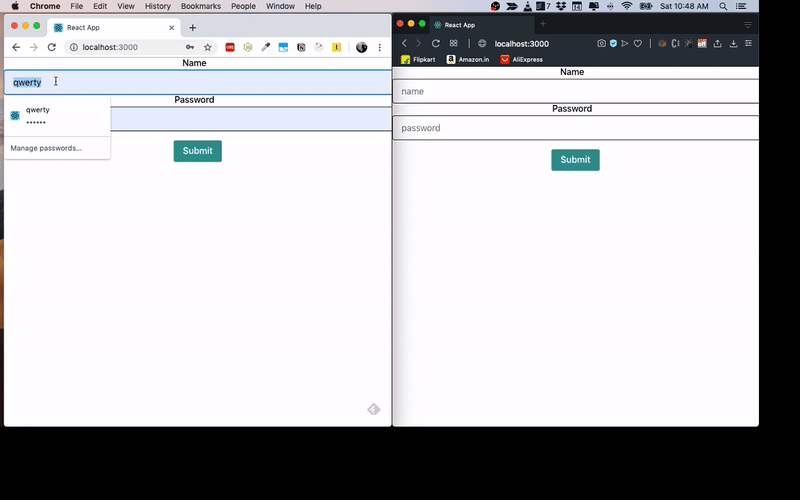

## Building a Chat Application using React,GraphQL and Hasura

This Repository demonstrates how to build a chat application using react with apollo react hooks for GraphQL and Hasura and postgres for backend

### Demo



Packages for React Application

- [@apollo/react-hooks](https://www.apollographql.com/docs/react/api/react-hooks/) - it is used to handle all the graphql queries,mutation and subscriptions using react hooks.
- [apollo-link-ws](https://www.npmjs.com/package/apollo-link-ws) - this package is used to connect web socket with our backend.
- [apollo-link-http](https://www.apollographql.com/docs/link/links/http/) - it is used to connect http with our backend.
- [apollo-link](https://blog.apollographql.com/apollo-link-the-modular-graphql-network-stack-3b6d5fcf9244) - it act as a network interface for graphql request and fetching the result. Here, apollo link is used to split the http and web socket connections.
- [apollo-utilities](https://www.npmjs.com/package/apollo-utilities) - this package is used get the information of graphql queries.
- [apollo-cache-memory](https://www.npmjs.com/package/apollo-cache-inmemory) - it is used for caching the graphql results.

### To Run the Application

```
   npm install
   npm run start
```
